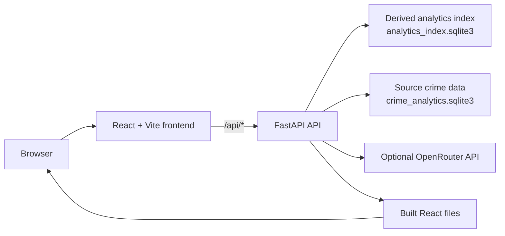

# INTELLECTUS

INTELLECTUS is a police case analytics web application. It combines a React dashboard with a FastAPI retrieval API over the supplied crime-record SQLite database. The application can run locally as separate frontend and backend servers, or as one FastAPI service on Zoho Catalyst AppSail.

**Deployed application:** [INTELLECTUS on Zoho Catalyst AppSail](https://intellectus-web-50044248712.development.catalystappsail.in)

## Features

- **AI Assistant** — answers case-analysis questions using deterministic SQL, local semantic/vector retrieval, graph retrieval, and optional OpenRouter-assisted intent parsing and synthesis.
- **Conversational context** — keeps a session-based conversation history; conversations can be cleared through the API.
- **Evidence citations** — assistant answers return clickable FIR and criminal-profile citations that open the relevant records.
- **Case search** — debounced search across FIRs and criminal profiles, with result filters for district, gravity, status, category, and date range.
- **FIR case details** — shows incident information, people, complainants, victims, arrests, and chargesheet information where it exists in the source data.
- **Criminal profiles** — presents identity details, past FIRs, arrest history, and repeat-case counts.
- **Dashboard and analytics UI** — overview, analytics, administration, settings, OCR scanner, and voice-assistant screens.
- **Responsive React UI** — dark mode, language controls, toasts, modals, PDF export utilities, and chart components.
- **Production single-origin hosting** — FastAPI serves the built React application and `/api/*` endpoints from the same domain.

## Architecture



### Request flow

1. In development, Vite serves the React UI on port `3000` and proxies `/api/*` to FastAPI on port `8000`.
2. FastAPI creates a derived analytics index from the source crime database at startup.
3. API routes query the source/index databases and return JSON to the frontend.
4. For production, FastAPI serves the React build as static files, so the UI and API share one origin.

## Technology stack

| Area | Technology |
| --- | --- |
| Frontend | React 19, TypeScript, Vite 8, Tailwind CSS 4 |
| State and UI | Redux Toolkit, React Redux, Recharts, Lucide React |
| Backend | Python, FastAPI, Uvicorn, Pydantic, HTTPX |
| Data | SQLite (`crime_analytics.sqlite3` and derived `analytics_index.sqlite3`) |
| AI integration | Optional OpenRouter-compatible chat-completions API |
| Hosting | Zoho Catalyst AppSail (Python 3.13) |

## Repository layout

```text
INTELLECTUS/
├── frontend/                 # React/Vite application
│   ├── src/pages/            # Dashboard, search, assistant, settings, etc.
│   └── src/utils/api.ts      # Typed API client
├── backend/
│   ├── app.py                # FastAPI application and retrieval logic
│   ├── crime_analytics.sqlite3
│   ├── requirements.txt
│   ├── frontend_dist/        # AppSail copy of the production frontend build
│   └── vendor/               # Linux Python dependencies bundled for AppSail
├── .catalystrc               # Catalyst project connection
└── .gitignore
```

## Run locally

### Prerequisites

- Node.js 22+ and npm
- Python 3.10+
- A Python virtual environment in `backend/.venv` with `backend/requirements.txt` installed

### Development mode — two terminals

Terminal 1, start the API from the `backend` directory:

```powershell
cd "C:\Users\vihan gaur\Desktop\KSP-2.5\INTELLECTUS\backend"
.venv\Scripts\python.exe -c "from pathlib import Path; original=Path.exists; Path.exists=lambda self: False if self.name == 'vendor' else original(self); import uvicorn; uvicorn.run('app:app', host='127.0.0.1', port=8000)"
```

Terminal 2, start the frontend:

```powershell
cd "C:\Users\vihan gaur\Desktop\KSP-2.5\INTELLECTUS\frontend"
npm.cmd ci
npm.cmd run dev
```

Open [http://localhost:3000](http://localhost:3000).

The backend command intentionally skips `backend/vendor`, which contains Linux wheels for AppSail. It does not modify any files; the Windows virtual environment is used instead.

If Vite shows `http proxy error` or `ECONNREFUSED` for `/api/*`, the backend is not running on port `8000`. Start Terminal 1 and keep it open.

### Production-style local mode — one server

Build the frontend:

```powershell
cd "C:\Users\vihan gaur\Desktop\KSP-2.5\INTELLECTUS\frontend"
npm.cmd ci
npm.cmd run build
```

Then run FastAPI from `backend` using the same local-safe command:

```powershell
cd "C:\Users\vihan gaur\Desktop\KSP-2.5\INTELLECTUS\backend"
.venv\Scripts\python.exe -c "from pathlib import Path; original=Path.exists; Path.exists=lambda self: False if self.name == 'vendor' else original(self); import uvicorn; uvicorn.run('app:app', host='127.0.0.1', port=8000)"
```

Open [http://localhost:8000](http://localhost:8000).

## Environment configuration

The API works without an LLM key using local retrieval and heuristic intent routing. To enable the optional OpenRouter path, create `backend/.env`:

```env
OPENROUTER_API_KEY=your_key_here
OPENROUTER_MODEL=openai/gpt-4o-mini
```

Never commit `.env` files or API keys.

## Zoho Catalyst AppSail deployment

The workspace is connected to Catalyst project `INTELLECTUS` (`51422000000016001`) and is deployed as the AppSail service `intellectus-web`.

Deployment uses the `backend/` directory as the AppSail build path:

- `backend/frontend_dist/` is the copy of `frontend/dist/` served by FastAPI in AppSail.
- `backend/vendor/` contains Linux-compatible Python dependencies needed by the managed Python runtime.
- Catalyst starts the service with `PYTHONPATH=vendor python3 -m uvicorn app:app` on `X_ZOHO_CATALYST_LISTEN_PORT`.

To prepare and deploy a new frontend version:

```powershell
cd frontend
npm.cmd ci
npm.cmd run build

Copy-Item -LiteralPath .\dist -Destination ..\backend\frontend_dist -Recurse -Force

cd ..
catalyst.cmd deploy appsail --name intellectus-web --build-path backend --stack python_3_13 --command "sh -c 'PYTHONPATH=vendor python3 -m uvicorn app:app --host 0.0.0.0 --port ${X_ZOHO_CATALYST_LISTEN_PORT}'" --dc in
```

After deploying, verify both the app URL and `/api/overview`.

## Current data and UI notes

- FIR search, FIR details, criminal profiles, citations, and the AI assistant call the live backend.
- Some Dashboard, Analytics, Admin, and Settings content is currently presentation/mock data.
- The source dataset does not provide a persistent cross-case person identifier, so repeat-offender matching is name-based.
- Some detail fields, such as per-case act/section and evidence files, may appear as `Not recorded` when they are unavailable from the source database.
